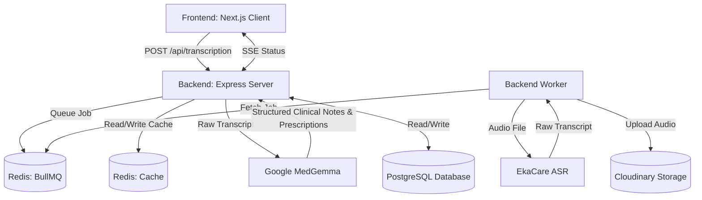

# MedScribe AI

## Description
MedScribe AI is a Next-Generation Medical Scribe AI and Clinical Voice OS designed to streamline healthcare workflows. By converting doctor-patient conversations into organized digital medical records, it saves practitioners time, reduces documentation overhead, and improves clinical accuracy.

## Features
- **Intelligent Voice Transcription**: High-accuracy Speech-to-Text customized for medical terminology and regional accents (via EkaCare ASR).
- **Automated Clinical Structuring**: Extracts comprehensive clinical summaries, diagnoses, and prescriptions directly from audio using MedGemma (medgemma-4b-it), an open foundation model by Google Research trained specifically on medical datasets.
- **Smart Clinical Inference**: Automatically infers standard medication routes and fallback dosages based on the detected dosage form (e.g., inferring "Oral" and "1 tablet" for tablet forms) when not explicitly spoken.
- **Print-Ready E-Prescriptions**: Generates clean, dynamically-sized, and highly-styled digital prescriptions directly via React without legacy HTML templating, optimizing layout based on content density.
- **Event-Driven Architecture**: Asynchronous transcription queues managed by BullMQ and Redis, keeping the main API threads unblocked. Client updates are streamed via Server-Sent Events (SSE).
- **Distributed Caching Strategy**: Implemented Redis to cache high-read clinical history endpoints, drastically reducing PostgreSQL load, minimizing P99 latency, and ensuring high availability during peak clinic hours.
- **Role-Based Access Control**: Secure workflows tailored for Doctors, Clinical Admins, System Admins, and Clinic Staff.
- **Massive Clinical Database**: Over 300,000+ Indian medications and formulations accurately scraped from 1mg, providing exhaustive coverage for prescriptions.
- **High-Throughput Entity Resolution Engine**: Achieves low latency when mapping unstructured, noisy audio transcriptions to a canonical catalog of 300,000+ medications. Engineered using a Node.js worker pool for parallel execution, in-memory sharded phonetic indexing, Levenshtein distance scoring for typo-tolerance, and an LRU cache to guarantee O(1) resolution for frequent prescriptions.
## Tech Stack
- **Frontend**: Next.js, React, Tailwind CSS, TypeScript
- **Backend**: Node.js, Express, TypeScript, PostgreSQL
- **Caching & Queues**: Redis, BullMQ
- **AI/ML**: Google MedGemma (medgemma-4b-it), EkaCare ASR
- **Infrastructure**: Docker (Database & Redis), Cloudinary (Audio Storage)

## Architecture & HLD Diagram




## Application Flow
1. **Live Dictation**: The Doctor records audio via the Next.js frontend during a patient encounter.
2. **Asynchronous ASR**: The audio is pushed to the backend, which queues a BullMQ job and immediately returns a tracking ID. A background worker transcribes the audio using EkaCare's ASR.
3. **Real-time Updates**: The frontend tracks transcription progress via Server-Sent Events (SSE).
4. **LLM Structuring**: The raw transcript is reviewed and sent to Google Research's MedGemma LLM, which strictly extracts notes, diagnoses, and raw prescription entities via NER.
5. **High-Speed Drug Mapping**: The raw spoken medications are routed through our optimized multi-threaded matching engine to snap them perfectly to the 1mg database standard.
6. **Record Finalization**: The finalized digital prescription and clinical notes are securely saved to PostgreSQL (with high-read caching in Redis), making them instantly accessible for patient history review.

## Deep Dive: Entity Resolution Engine
To map spoken, noisy drug names (e.g., "dolo 650") to our canonical database of 300,000+ medications, we built a highly optimized matching engine:
- **Parallel Execution (`worker_threads`)**: Incoming drug matching requests are offloaded to a pool of background Node.js workers to ensure the main API thread is never blocked during heavy string-comparison computations.
- **In-Memory Sharded Phonetic Indexing**: Instead of searching the entire DB, medications are loaded into memory and bucketed (sharded) by their starting phonetics (using algorithms like Soundex/Metaphone). This drastically reduces the search space.
- **Levenshtein Distance Scoring**: When an exact match isn't found, the engine calculates the edit distance between the transcribed text and the indexed phonetic buckets to tolerate speech-to-text typos.
- **LRU Cache (O(1) Resolution)**: Frequently prescribed drugs are cached in memory using a Least Recently Used (LRU) policy, completely bypassing the matching algorithms and returning results in constant O(1) time.

## Folder Structure
```text
medscribe-ai/
├── backend/
│   ├── src/
│   │   ├── controllers/      # API Request Handlers
│   │   ├── services/         # Business Logic, Redis, & External Integrations
│   │   ├── routes/           # Express Route Definitions
│   │   ├── middleware/       # Auth & Role Guards
│   │   └── index.ts          # Server Entry Point
│   ├── 1mgDrugsScraper/      # Scripts for drug data collection
│   ├── .env.example
│   └── package.json
├── frontend/
│   ├── src/
│   │   ├── app/              # Next.js App Router (Pages & Layouts)
│   │   ├── components/       # Reusable UI Components
│   │   ├── lib/              # Utility Functions & State
│   │   └── types/            # TypeScript Definitions
│   ├── public/               # Static Assets (Logos, Icons)
│   ├── .env.example
│   └── package.json
└── docker-compose.yml        # Local DB & Redis Infrastructure
```

## Setup Instructions

### 1. Prerequisites
- Node.js (v18+)
- Docker & Docker Compose
- PostgreSQL & Redis (if not using Docker)

### 2. Database & Redis Setup (Docker)
We use Docker to quickly spin up the PostgreSQL database and Redis instance.
```bash
# Start the database and redis in the background
docker-compose up -d
```

### 3. Backend Setup (API & Worker)
```bash
cd backend
npm install

# Setup environment variables
cp .env.example .env
# Edit .env with your specific API keys and credentials

# Start the backend server (Starts both the Express API and the BullMQ background worker)
npm run dev
```

### 4. Frontend Setup
```bash
cd frontend
npm install

# Setup environment variables
cp .env.example .env.local
# Edit .env.local with appropriate backend URLs if needed

# Start the frontend application
npm run dev
```
Access the web application at [http://localhost:7000](http://localhost:7000).

### 5. Running the 1mg Drugs Scraper
To seed or update the drugs database, a scraper script is provided. Ensure the backend dependencies are installed and the database is running.
```bash
cd backend
npx ts-node 1mgDrugsScraper/scrape.ts
```
*Note: Ensure you comply with the target website's Terms of Service and rate limits when running the scraper.*

## Security & Compliance
- Ensure `SESSION_SECRET` and `SUPERADMIN_PASSWORD` are changed in production environments.
- Protect all `.env` files and never commit them to version control.
